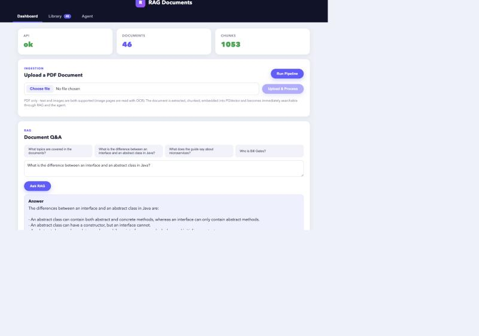
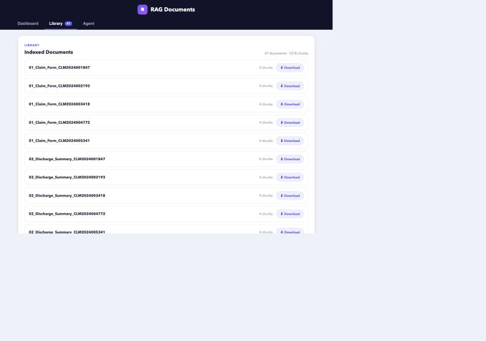
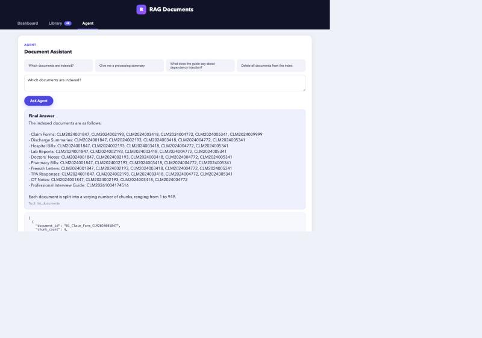

# RAG Documents — Java + Angular

A **generic PDF document intelligence** application: upload documents (text
**and images**, built-in OCR), vector indexing, a paginated library with PDF
viewing/downloading, grounded RAG Q&A and a tool-using agent. Backend in
**Java 21 / Spring Boot 4.1**, frontend in **Angular 20**. The LLM is
pluggable: a **free local Ollama** model, or optionally **Claude** (official
Anthropic SDK) — no OpenAI dependency.

| Layer | Tech |
|---|---|
| Backend | Spring Boot 4.1, Maven |
| LLM | **Claude Opus 5.5** via `com.anthropic:anthropic-java` (default) **or free local Ollama** (`LLM_PROVIDER=ollama`) |
| Embeddings | Local ONNX `all-MiniLM-L6-v2` (384 dims) — no API call |
| Vector store | PostgreSQL + pgvector (Docker, host port **5442**) |
| PDF | Apache PDFBox (text) + **Tesseract OCR** (image/scanned pages) |
| Agent | Native Claude tool use (or a 2-step flow on Ollama) + read-only guardrails |
| API | Spring Web REST, Swagger via springdoc |
| UI | Angular 20 standalone + signals |

## Screenshots

**Dashboard** — metrics, PDF upload and RAG Q&A with a grounded answer:



**Library** — paginated library with PDF viewing and downloading:



**Agent** — document assistant (selected tool + final answer):



## Quick start (free local mode)

> Full step-by-step installation: see **[INSTALL.md](INSTALL.md)**.

Three commands, in three terminals, from the project root:

```bash
# 1. Infra: PGVector + Ollama (+ OCR)
docker compose up -d && brew services start ollama
```

```bash
# 2. Backend (port 8085)
cd backend && LLM_PROVIDER=ollama mvn spring-boot:run
```

```bash
# 3. Frontend (port 4200)
cd frontend && npm start
```

Then open http://localhost:4200. To use Claude instead of Ollama, drop
`LLM_PROVIDER=ollama` and export `ANTHROPIC_API_KEY` before command 2.

## How it works

```text
PDFs (data/raw, recursive)          POST /documents/upload
        │                                   │
        ▼                                   ▼
Text extraction (PDFBox) + OCR of image pages (Tesseract)
        ▼
Cleaning → chunks (1000 chars / 150 overlap)
        ▼
Local ONNX embeddings → PGVector (document_chunks table, cosine <=>)
        ▼
Grounded RAG Q&A (sources + distances) · Tool-using agent
```

One PDF = one document; the id is derived from the filename. Every step is
idempotent: re-running the pipeline only processes new documents.

## Endpoints

| Method | Endpoint | Purpose |
|---|---|---|
| GET | `/health` | API status |
| GET | `/pipeline/status` | Generated artifact status |
| POST | `/pipeline/run` | Full pipeline (idempotent) |
| GET | `/documents?page=0&size=10` | Indexed documents, **server-side pagination** (SQL LIMIT/OFFSET, 10 per page by default, `size` max 50; returns `page`, `total_pages`, `total_documents`, `total_chunks`) |
| GET | `/documents/{id}/file` | The original PDF: inline in the browser, or download with `?download=true` |
| POST | `/documents/upload` | Upload a PDF (multipart `file`, 25 MB max) + automatic processing |
| POST | `/rag/ask` | Grounded RAG question (`{"question", "top_k", "use_cache"}`) |
| POST | `/agent/ask` | Document agent (`{"question"}`) |

Swagger: http://localhost:8085/swagger-ui.html

## UI (Angular)

**Light** theme: dark navigation bar (logo and tabs), content on a light gray
background with rounded white cards and indigo accents. Three menus:

- **Dashboard**: metrics (API, documents, chunks), PDF upload + Run Pipeline,
  RAG Q&A with sources and distances.
- **Library**: paginated library (10 documents per page, server-side
  pagination); each document name is a **link that opens the PDF** in a new
  tab, and every row has a **Download** button.
- **Agent**: document assistant (visible tool selection + final answer + raw
  tool result).

The palette is driven by the CSS variables at the top of
`frontend/src/styles.css`.

## The agent

Three read-only tools: `list_documents`, `summarize_pipeline_outputs`,
`ask_documents` (RAG). With the Claude provider, routing uses the API's
**native tool use** (the SDK BetaToolRunner drives the loop). With Ollama, a
two-step flow runs instead: schema-constrained JSON tool selection → Java-side
execution → final answer. In both modes, destructive requests (delete, drop…)
are blocked before any LLM call.

## Configuration

| Variable | Values | Default |
|---|---|---|
| `LLM_PROVIDER` | `claude` \| `ollama` | `claude` |
| `ANTHROPIC_API_KEY` | API key (claude mode) | — |
| `CLAUDE_MODEL` | Claude model | `claude-opus-5-5` |
| `OLLAMA_MODEL` | any Ollama model | `qwen2.5:14b` |
| `OLLAMA_BASE_URL` | server URL | `http://localhost:11434` |
| `OCR_LANGUAGE` | Tesseract languages (e.g. `eng+fra`) | `eng` |
| `TESSDATA_PREFIX` | traineddata folder | `/opt/homebrew/share/tessdata` |
| `RETRIEVAL_DISTANCE_THRESHOLD` | no-context threshold | `1.25` |

Other settings live in `backend/src/main/resources/application.yml`
(`docintel.*` prefix: chunk-size, chunk-overlap, data-root…).

## Data

- `data/raw/`: source PDFs (subfolders allowed); uploads go to
  `data/raw/uploads/`.
- `data/processed/`: extracted text, cleaned text, chunks, manifest.
- `data/output/`: RAG answer cache, processing summary.
